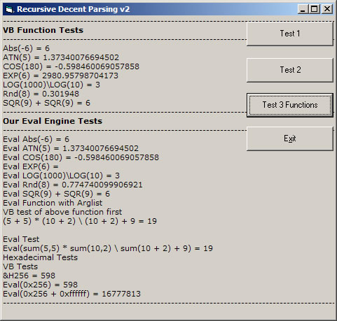



## Mathematic Expression Evaluator Final

### Description

Full Mathematic Expression Evaluator for VB 6 Support all Operaotrs, + - * / \ ^ % and Parms, Relational operators &lt;&gt; &lt;= &gt;= &lt;&gt; ==, Variable Support, Bitwise Operaotrs, Or, And, Xor, !=, &&, ||, MOD, DIV, SHL, SHR, &gt;&gt; &lt;&lt; Increment/Decrement operators -- ++, Hex support, Functions and more.

Please Vote.
 
### More Info
 

             |
---                |---
**Submitted On**   |2006-01-22 23:01:14
**By**             |[dreamvb](https://github.com/Planet-Source-Code/PSCIndex/blob/master/ByAuthor/dreamvb.md)
**Level**          |Intermediate
**User Rating**    |5.0 (50 globes from 10 users)
**Compatibility**  |VB 3\.0, VB 4\.0 \(16\-bit\), VB 4\.0 \(32\-bit\), VB 5\.0, VB 6\.0
**Category**       |[Math/ Dates](https://github.com/Planet-Source-Code/PSCIndex/blob/master/ByCategory/math-dates__1-37.md)
**World**          |[Visual Basic](https://github.com/Planet-Source-Code/PSCIndex/blob/master/ByWorld/visual-basic.md)
**Archive File**   |[Mathematic198547462006\.zip](https://github.com/Planet-Source-Code/dreamvb-mathematic-expression-evaluator-final__1-64933/archive/master.zip)

